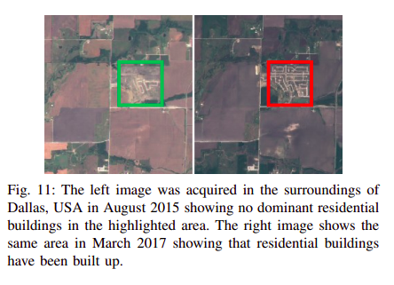
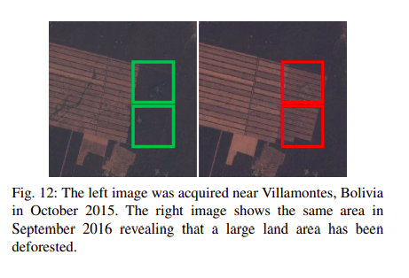
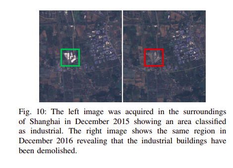

# Land Cover and Land Use Classification using Sentinel-2 Dataset and Deep Learning
----------------------------------------------------------------------
CORRECT BLOG LINK
For better read <> Check out this [blog](https://medium.com/p/951faa0cbb31/edit)

### Scenario
Many government programs are taking enormous efforts to convert make satellite images free and open sourced inorder to bring in innovation and entrepreunership. This is being used by many domains and are coming up with good results. Inorder to get great insights and knowldge from this satellite data we have to segment and understand it for further studies. Such type of a task is Landcover classification which come up and automate the process of identifying how the land area is used. We have seen a great spike in the growth of Machine learning and Artificial intelligence. Almost all domain in the world is using Deep learning techniques to improve the performance and are benefiting from this. So here we try to use deep learning methods to work with land cover classification.

### Overview

 
[Source](https://arxiv.org/pdf/1709.00029.pdf)

A satellite scans the Earth to acquire images of it. Patches extracted out of these images are used for classification.
The aim is to automatically provide labels describing the represented physical land type or how the land is used. For this
purpose, an image patch is feed into a classifier, in this illustration a neural network, and the classifier outputs the class shown
on the image patch.

we use mutli-spectral image data provided by the Sentinel-2A satellite in order to address the challenge
of land use and land cover classification. Sentinel-2A is one satellite in the two-satellite constellation of the identical land monitoring satellites Sentinel-2A and Sentinel-2B. 

This satellite conver 13 spectral bands, where the  three bands B01, B09 and B10 are intended to be used for the correction of atmospheric effects (e.g., aerosols, cirrus or water vapor). The remaining bands are
primarily intended to identify and monitor land use and land cover classes. Each satellite will deliver imagery for at least 7 years with a spatial resolution of up to 10 meters per pixel.

In order to improve the chance of getting valuable image patches, they have selected satellite images with a low cloud level. Besides the possibility to generate a cloud mask, ESA provides a cloud level value for each satellite image allowing to quickly select images with a low percentage of clouds covering the land scene.

### Dataset
Whenever we are working with supervised machine learning we need a dataset to train the model on, here we choose EuroSAT. 
1) EuroSAT dataset is open sourced. 
2) It consist of satellite images RGB and multi spectral - covering 13 spectral bands (including visible, newar infrared, shortwave infrared) with 10 unique classes. 
3) It consist of 27000 labeled and geo referenced images.
4) Geo-referenced.
5) The dataset is published and benchmarked with CNN by a paper titled **EuroSAT: A Novel Dataset and Deep Learning Benchmark for Land Use and Land Cover
Classification**  and they have made dataset public through this [repo]( https://github.com/phelber/eurosat).

##### Some issues of satellite data handled by dataset:
1) Cloud appearence
2) Color casting due to atmospheric effects
3) Dead/pixels 
4) Ice or snow

##### Band Evaluation
In order to evaluate the performance of deep CNNs using single-band images as well shortwave-infrared and colorinfrared band combinations, we used the pretrained ResNet-50 with a fixed training-test split to compare the performance of the different spectral bands.

For evaluating single-band image they inserted the information from a single spectral band on all three input channels.

Bands with a lower spatial resolution have been upsampled to 10 meters per pixel using cubic-spline interpolation.

### Working

Recent years has shown greater impact on the use of deepl learning on all domains more than other machine learning model. We follows the same scenario and use deep learning => Convolutional Neural networks which is best for these kind of scenario. 
We also use transfer learning method, where we download a pretrained version of a model trained on a larger dataset (here it is image classification dataset ILSVRC-2012). Then we freeze the some part of the model and fine tune the newly added layers and finally tune all the layers to increase the accuracy.
We also use scheduler to optimize the learning rate, then we use gradient clipping to overcome to prevent exploding gradients.
We write all our script in pytorch. Split the dataset into 10/90 test and train dataset. And used the model which gave the most validation accuracy.

### Applications
With this dataset and high classification accuracy we are able to look for change detection in Sentinel-2 satellite images. Since the Sentinel-2 satellite constellation will scan the
Earth’s land surface for about the next 20 - 30 years on a
repeat cycle of about five days, a trained classifier can be used
for monitoring land surfaces and detect changes in land use
or land cover. 

Some change detection examples are illustrated below

  
[Source](https://arxiv.org/pdf/1709.00029.pdf)

 
[Source](https://arxiv.org/pdf/1709.00029.pdf)

 
[Source](https://arxiv.org/pdf/1709.00029.pdf)

### Challenges

There are lots of challenges while evaluating raw images from satellite for prediction which includes Cloud appearence, Color casting due to atmospheric effects, Dead/pixels, Ice or snow. More than that a classification system trained with 64x64 image patches does not allow a finely graduated per-pixel  segmentation, it cannot only detect changes as shown in the previous examples, but it can also facilitate keeping maps up-to-date. Also when there is mixed elemets in the same image patches that can also lead to trouble. 

### Reference

[EuroSAT: A Novel Dataset and Deep Learning
Benchmark for Land Use and Land Cover
Classification](https://arxiv.org/abs/1709.00029)

@inproceedings{helber2018introducing,
  title={Introducing EuroSAT: A Novel Dataset and Deep Learning Benchmark for Land Use and Land Cover Classification},
  author={Helber, Patrick and Bischke, Benjamin and Dengel, Andreas and Borth, Damian},
  booktitle={IGARSS 2018-2018 IEEE International Geoscience and Remote Sensing Symposium},
  pages={204--207},
  year={2018},
  organization={IEEE}
}